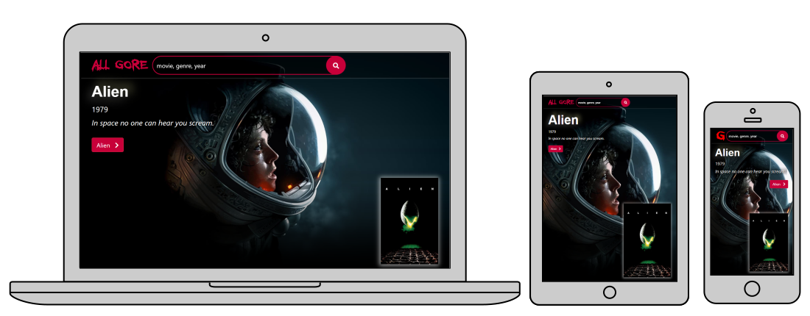
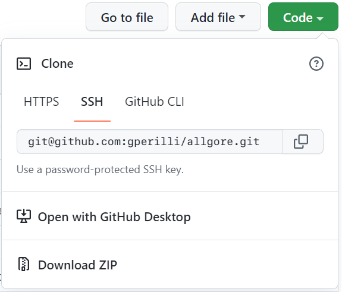

# Allgore

A horror movie database, and movie list site. Allgore is a website dedictaed to horror movies with hundreds of movies seeded from TMDB.


<br>


## Built With
- [Rails 6](https://guides.rubyonrails.org/) - Backend / Front-end
- [Heroku](https://heroku.com/) - Deployment
- [PostgreSQL](https://www.postgresql.org/) - Database
- [Bootstrap](https://getbootstrap.com/) — Styling

## Set Up a Local Development Environment

### Getting the project files

Download this project code from this Github page. Either do a direct download or use a command line git clone command:
```
git clone git@github.com:gperilli/allgore.git
```
<br>


For more information on getting git (version control system) on your local machine, see [this](https://git-scm.com/book/en/v2/Getting-Started-Installing-Git).

### Setting up a Ruby on Rails development environment: General Outline

This is a ruby on rails web app, so first set up a rails development environment on your local machine. If you are using Windows, this will probably involve setting up [WSL](https://learn.microsoft.com/en-us/windows/wsl/install), Windows subsystem for Linux, [rbenv](https://github.com/rbenv/rbenv), a ruby environment manager, and Ruby, the language upon which Rails works. Next install [Node.js](https://nodejs.org/en/), [yarn](https://yarnpkg.com/), and [PostgreSQL](https://www.postgresql.org/), then you're good to go.


### More Details on Setting Up A Rails Environment on a Linux Machine

#### git: version manager
Install git:
```
sudo apt update
sudo apt install -y git
```


#### Github CLI: command line interface for Github
Install github CLI:

```
sudo apt-key adv --keyserver hkp://keyserver.ubuntu.com:80 --recv-key C99B11DEB97541F0
sudo apt-add-repository https://cli.github.com/packages
sudo apt update
```

Then:
```
sudo apt install -y gh
```

Check the version:
```
gh --version
```

Configure Github CLI

```
gh auth login -s 'user:email' -w
```
Follow the instructions to connect the local Guthub CLI with your Github account.

Confirm Guthub CLI connection with:
```
gh auth status
```
This should display: `Logged in to github.com as <YOUR USERNAME>`

Configure GIthub CLI with SSH:
```
gh config set git_protocol ssh
```

#### Confugure SSH connection with Github

Generate SSH codes:
```
mkdir -p ~/.ssh && ssh-keygen -t ed25519 -o -a 100 -f ~/.ssh/id_ed25519 -C "TYPE_YOUR_EMAIL@HERE.com"
```

Give the SSH public key to your Guthub account:
```
gh auth refresh -s write:public_key
```
Run this to set the SSH key locally:
```
gh ssh-key add ~/.ssh/id_ed25519.pub
```

#### zsh: custom shell
Install imagemagick:
```
sudo apt install -y zsh curl vim imagemagick jq
```

install zsh
```
sh -c "$(curl -fsSL https://raw.github.com/ohmyzsh/ohmyzsh/master/tools/install.sh)"
```

#### rbenv: ruby version manager
Check if rbenv is installed:
```
rvm implode && sudo rm -rf ~/.rvm
```
The response should be `zsh: command not found: rvm` if it is absent.

Use this to remove previous installation:
```
rm -rf ~/.rbenv
```
install rbenv using git clone:
```
git clone https://github.com/rbenv/rbenv.git ~/.rbenv
```

configure the shell to load rbenv for Zsh:
```
echo 'eval "$(~/.rbenv/bin/rbenv init - zsh)"' >> ~/.zshrc
```
rbenv repository details: https://github.com/rbenv/rbenv#basic-git-checkout


#### Ruby: server side programming language
Install Ruby version 2.7.4:
```
rbenv install 2.7.4
```

Set Ruby 2.7.4 as the gloabl default Ruby version:

```
rbenv global 2.7.4
```

Restart the terminal, and check the installed Ruby version with:
```
ruby -v
```

#### Node: server side Javascript
Install the Node version manager:
```
curl -o- https://raw.githubusercontent.com/nvm-sh/nvm/v0.37.0/install.sh | zsh
```

restart the terminal, then confirm the installed version of Node:
```
nvm -v
```

Install Node version 14.15:
```
nvm install 14.15
```
Confirm the installation of Node:
```
node -v
```

#### Yarn: Javascript package manager
Install yarn:
```
npm install --global yarn
```

Confirm the installed yarn version:
```
yarn -v
```

#### PostgreSQL: Database
Install the PostgreSQL database:
```
sudo apt install -y postgresql postgresql-contrib libpq-dev build-essential
```

### Setting Up Allgore for Development
Navigate to the downloaded project files, then do the following to run the web app on a local server:

#### Intall Ruby Gems and Javascript Packages
Install gems
```
bundle install
```
Install JS packages
```
yarn install
```
Install Rails:
```
gem install rails -v 6.0.3
```

### Confirm that the PostgreSQL databse is running:
In another terminal window:
```
sudo systemctl status postgresql
```
This sholud show something like:

```
postgresql.service - PostgreSQL RDBMS
     Loaded: loaded (/lib/systemd/system/postgresql.service; enabled; vendor pr>
     Active: active (exited) since Mon 2023-10-23 07:59:05 JST; 4h 5min ago
   Main PID: 974 (code=exited, status=0/SUCCESS)
        CPU: 1ms
```

The databse server can be started and stopped with:

```
sudo systemctl start postgresql
```

```
sudo systemctl stop postgresql
```

### Create and set the ENV Variables
An [IMDB](https://stripe.com/) API key is required to add more movies to the database. Please create a `.env` file and add your IMDB API key in order to do this.

Create `.env` file in the project folder:
```
touch .env
```
Inside `.env`, set this variable:
```
IMDB_KEY='********'
```

### Create, migrate, and seed the project databse:
```
rails db:create
rails db:migrate
rails db:seed
```

The seed file will import all the movies in the `seed_list_curated.csv` file.

To get more horror movies from the IMDB database, use this command:
```command
rails runner lib/generate_csv_data_from_api_search.rb
```
This will output a csv file with the movie data. Add this manuualy to the `seed_list_curated.csv` file, and then run the Rails seed, `rails db:seed` to get these movies in the database.

Running `rails runner lib/generate_csv_data_from_api_search.rb` can take some time because the code is looking through the IMDB collection and selecting movies within the horror genre.


### Run The Rails Server
Run this command to execute the Rails server, then go to `localhost:3000` to see the running app.
```
rails s
```


## Contributing
Pull requests are welcome. For major changes, please open an issue first to discuss what you would like to change.

## License
[](https://creativecommons.org/licenses/by-nc-sa/4.0/)


